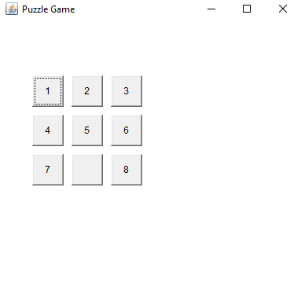
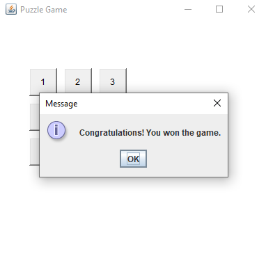

# Java Puzzle Game

<p align="justify"> ✍This repository contains the Java code for a simple puzzle game, built using Java's Abstract Window Toolkit (AWT) and Swing. The game involves sliding tiles to arrange numbers in a correct sequence to win.</p>

## Project Description

<p align="justify">The Puzzle game features a 3x3 grid where numbers 1 through 8 are shuffled, and one slot is left empty. The player can move the numbers by clicking on a number next to the empty slot. The goal is to arrange the numbers in order from 1 to 8, where the empty slot is at the bottom right in the final position.</p>

## Features

- **Graphical User Interface**: Utilizes Java AWT and Swing for the UI components.
- **Event Handling**: Implements ActionListener to handle button click events.
- **Game Logic**: Includes logic to check the win condition and respond to user moves appropriately.

## Setup

To run this project, you will need a Java Development Kit (JDK) installed on your computer.

### Prerequisites

- Java Development Kit (JDK), version 8 or above (Download from: [Oracle JDK](https://www.oracle.com/java/technologies/javase-jdk11-downloads.html))

### Running the Game

1. Clone the repository to your local machine.
2. Open your command line interface (CLI).
3. Navigate to the directory containing the game files.
4. Compile the Java code:
   ```bash
   javac your_file_name.java
   ```

### Output Screen

- Before Playing the game
#### Before play fame
  

- After playing the game
#### AFTER Play the game
   
